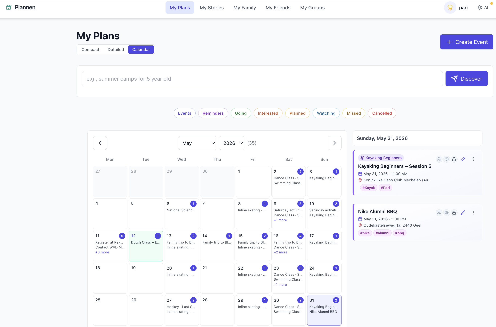
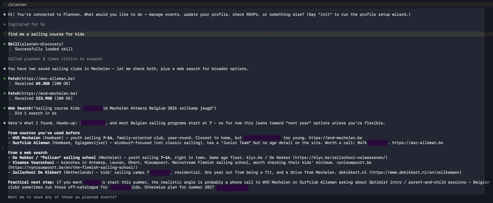

<p align="center">
  
</p>

<p align="center"><em>Local-first AI planner that learns your preferences and turns events into memories.</em></p>

<p align="center">
  <a href="LICENSE"></a>
  <a href="https://github.com/pariksheet/plannen/actions/workflows/ci.yml"></a>
</p>

<p align="center">
  
</p>

<p align="center"><sub>… or skip the web app and just talk to Claude.</sub></p>

<p align="center">
  
</p>

Plannen is a local-first AI planner. It knows your preferences and past events, helps you schedule what's next, and turns memorable moments into stories. Your data stays on your machine. Use it through the web app, or just talk to it from Claude Code or Claude Desktop — both surfaces drive the same local database via an MCP server.

---

## Why it works

Two pieces do the heavy lifting:

**An MCP server.** Plannen ships an [MCP server](mcp/) that exposes its data layer — events, profile facts, family members, locations, sources, stories — as tools Claude Code and Claude Desktop can call directly. You don't talk to a bespoke chatbot; you talk to Claude in whatever client you already use, and Claude reaches into your local Plannen database via MCP. Slash commands, the event-creation intent gate, discovery, source analysis, story generation, watch monitoring — all flow through this layer. The web app uses the same service functions, so the two surfaces stay in lockstep.

**A profile that learns.** Every time you mention something durable about yourself or your family in natural conversation — *"my son just turned 6"*, *"we prefer apartments over hotels"*, *"no highway charging when the kids are in the car"* — Plannen passively extracts the fact and saves it. The next time Claude plans something, it knows. Suggestions become personal: *"his school finishes Wednesday at 12:00, want a sports option that runs 13:00–15:00?"* rather than generic *"here are some sports classes in Belgium"*. The profile is also corrigible — you can ask Claude what it knows about you, fix anything wrong, and watch it stick.

Together these turn Plannen from a calendar into an assistant. The data stays on your machine; the intelligence travels with the AI client of your choice.

---

> **Tier 0 — Bundled (default).** Plannen runs on your computer with just Node 20+ — no Docker, no Supabase CLI. Postgres is an embedded binary started by Node; the MCP server talks to it directly. See [`docs/TIERED_DEPLOYMENT_MODEL.md`](docs/TIERED_DEPLOYMENT_MODEL.md) for the full tier model. Tier 1 (local Supabase + edge functions) stays available via `bash scripts/bootstrap.sh --tier 1` for users who want the full Docker stack.

---

## Prerequisites

### Tier 0 (default)

| Tool | Why | Install |
|------|-----|---------|
| [Node.js](https://nodejs.org/) ≥ 20 LTS | Runs the embedded Postgres, MCP server, web app | `brew install node` (or nvm/asdf/volta) |
| [Claude Code](https://claude.com/claude-code) (recommended) or [Claude Desktop](https://claude.ai/download) | The AI interface | claude.com/claude-code |

```bash
node --version  # expect v20+
```

### Tier 1 (opt-in — `--tier 1`)

Adds Docker + Supabase CLI to the above:

| Tool | Why | Install |
|------|-----|---------|
| A container runtime | Runs local Supabase (Postgres + Auth + Storage) | Docker Desktop, [Colima](https://github.com/abiosoft/colima), [OrbStack](https://orbstack.dev), Rancher Desktop |
| [Supabase CLI](https://supabase.com/docs/guides/cli) ≥ 2.0 | Manages local DB, migrations, seeds | `brew install supabase/tap/supabase` |

---

## Setup — one command

```bash
git clone <repo-url> plannen
cd plannen
bash scripts/bootstrap.sh                # Tier 0, default
# bash scripts/bootstrap.sh --tier 1     # opt-in to the local Supabase stack
```

That's it. In Tier 0, `bootstrap.sh` does prereq checks, npm install, starts an embedded Postgres at port 54322, applies migrations (Tier 0 overlay + main schema), inserts your user row, writes `.env` with `PLANNEN_TIER=0` + `DATABASE_URL`, and offers to install the Claude Code plugin. In Tier 1 it instead runs `supabase start`, `supabase migration up`, the auth-user admin call, and `functions-serve`.

The script is idempotent — re-run it any time. If something gets broken, `/plannen-doctor` (inside Claude Code) will diagnose and suggest the targeted fix.

For automated/CI use:

```bash
bash scripts/bootstrap.sh --non-interactive --email you@example.com [--install-plugin]
```

### After bootstrap

1. **Sign in to the web app.** `npm run dev`, then open [http://localhost:4321](http://localhost:4321). Enter the email you bootstrapped with and click *Magic link* — the link arrives at [Mailpit](http://127.0.0.1:54324) (no real email sent).

2. **Add your AI key (only if you'll use AI features in the web app).** In the web app, go to **/settings** and paste your Anthropic API key from [console.anthropic.com](https://console.anthropic.com). The key is stored in your local Plannen database (Tier 1) and never leaves your machine. It powers web-app AI features — event discovery, story generation, image extraction — that run via edge functions.

   You can skip this if you only drive Plannen via Claude Code or Claude Desktop: Claude itself supplies the intelligence in that path, and the MCP tools / slash commands (`/plannen-discover`, `/plannen-write-story`, …) work without a key in `/settings`.

3. **Use Claude.** If you accepted the plugin install at the end of bootstrap, you're done — Claude Code already has Plannen's tools and slash commands. Type `/plannen-doctor` to verify, then start chatting about events.

---

## Daily workflow

After a reboot, **one command brings the right stack up for your tier**:

```bash
bash scripts/start.sh            # everything Plannen needs (pg/supabase + backend + web dev)
bash scripts/start.sh --no-dev   # headless: pg + backend only (MCP/Claude use case)
bash scripts/stop.sh             # graceful umbrella shutdown
```

`start.sh` reads `PLANNEN_TIER` from `.env` and calls the right sub-scripts (`pg-start` + `backend-start` for Tier 0; `local-start` + `functions-start` for Tier 1). All sub-scripts are idempotent, so re-running on a live stack is a no-op.

### Auto-start at login (macOS)

Drop this LaunchAgent at `~/Library/LaunchAgents/com.plannen.start.plist`, then `launchctl load ~/Library/LaunchAgents/com.plannen.start.plist`:

```xml
<?xml version="1.0" encoding="UTF-8"?>
<!DOCTYPE plist PUBLIC "-//Apple//DTD PLIST 1.0//EN"
  "http://www.apple.com/DTDs/PropertyList-1.0.dtd">
<plist version="1.0">
<dict>
  <key>Label</key><string>com.plannen.start</string>
  <key>ProgramArguments</key>
  <array>
    <string>/bin/bash</string>
    <string>/absolute/path/to/plannen/scripts/start.sh</string>
    <string>--no-dev</string>
  </array>
  <key>RunAtLoad</key><true/>
  <key>StandardOutPath</key><string>/Users/YOU/.plannen/start.log</string>
  <key>StandardErrorPath</key><string>/Users/YOU/.plannen/start.log</string>
</dict>
</plist>
```

Drop `--no-dev` if you want the web dev server running on login too. (Tier 1 needs Docker to be running first; `OnDemand`/`KeepAlive` can be added if Docker startup is slow.)

### Lower-level (still works)

```bash
# Tier 0
bash scripts/pg-start.sh        # embedded Postgres on 54322
bash scripts/backend-start.sh   # Plannen backend on 54323
npm run dev                     # web app at http://localhost:4321

# Tier 1
bash scripts/local-start.sh     # start Supabase (Kong-patched)
bash scripts/functions-start.sh # start edge functions
npm run dev                     # web app at http://localhost:4321
```

Or just re-run `bash scripts/bootstrap.sh [--tier 1]` — it's idempotent and will auto-restore `supabase/seed.sql` if your DB is empty.

---

## Slash commands (in Claude Code)

After the plugin is installed:

| Command | What it does |
|---|---|
| `/plannen-doctor` | Diagnose Plannen — env, Supabase, MCP, plugin, functions-serve, AI key, Google keys. |
| `/plannen-setup` | Re-config `.env` (email, Supabase URL/keys, Google OAuth). Does NOT do first-time install — that's `bootstrap.sh`. |
| `/plannen-write-story <event>` | Compose a story from event memories and photos. |
| `/plannen-organise-photos <event>` | Drive the Google Photos picker for an event. |
| `/plannen-discover <query>` | Find events from saved sources + web search. |
| `/plannen-check-watches` | Force-process the watch queue now. |
| `/plannen-backup` | Run `scripts/export-seed.sh`. |

The plugin also bundles always-on workflow skills (event-creation intent gate, profile extraction, source analysis, etc.) — see `plugin/skills/` for details.

### Plugin scope: user vs project

By default, `bootstrap.sh` installs the plugin at **user scope** — it loads in every Claude Code session you start, anywhere on your machine. Verify with `claude plugin list` (look for `Scope: user`).

If you'd rather have Plannen load only when you're working inside this repo, reinstall at project scope:

```bash
claude plugin uninstall plannen
claude plugin marketplace remove plannen
claude plugin marketplace add ./ --scope project
claude plugin install plannen@plannen --scope project
```

Project-scope settings live in `.claude/settings.json` (committed to the repo, so the choice travels with the codebase). User-scope settings live in `~/.claude/settings.json` and reference the repo by absolute path — if you move or delete the repo, a user-scope install breaks.

Trade-offs:

- **User scope (default):** slash commands like `/plannen-doctor` are always available, even in unrelated projects. Convenient if you only have one Plannen checkout, but the MCP server runs in every session whether you need it or not.
- **Project scope:** plugin only activates inside this repo. Cleaner separation, no stale-path risk, but requires re-installing for each fresh clone.

### Using Plannen from Claude Desktop

Claude Desktop doesn't support plugins, but it can still talk to the MCP server. Register it once:

```bash
claude mcp add plannen -s user -- node "$(pwd)/mcp/dist/index.js"
```

This writes to `~/.claude.json`, which Claude Desktop reads on launch. Credentials come from `<repo-root>/.env` automatically (the MCP server loads it via dotenv), so no `-e` flags are needed. Restart Claude Desktop to pick up the registration.

To remove later: `claude mcp remove plannen -s user`.

---

## Before running `supabase db reset`

`supabase db reset` wipes the database. **Don't.** Use `supabase migration up` instead.

If you absolutely must reset, back up first:

```bash
bash scripts/export-seed.sh
```

This writes `supabase/seed.sql` and `supabase/seed-photos.tar.gz` (both gitignored). After reset, DB rows are restored automatically; restore photos with:

```bash
bash scripts/restore-photos.sh
```

This script extracts `seed-photos.tar.gz`, sets the `user.supabase.{cache-control,content-type,etag}` xattrs the storage worker reads (which `tar czf` strips), and inserts the matching `storage.objects` rows. Bare `tar xzf … -C /mnt` is **not** sufficient: files end up on disk but the storage API returns 404 (missing metadata row) or 500 ENODATA (missing xattrs). The script is idempotent — safe to re-run.

---

## Optional: Google Photos

For Claude-driven photo organisation of past events, configure Google OAuth:

1. In [Google Cloud Console](https://console.cloud.google.com/), create a project and enable the **Photos Library API**.
2. Generate OAuth 2.0 credentials of type **Web application**.
3. Register `http://127.0.0.1:54321/functions/v1/google-oauth-callback` as an authorised redirect URI.
4. Run `/plannen-setup` (in Claude Code) and paste the Client ID and Client Secret. The values are written to both `.env` and `supabase/functions/.env`. Restart the functions-serve process: `bash scripts/functions-stop.sh && bash scripts/functions-start.sh`.

---

## Project layout

```
plannen/
├── src/                    # React app (Vite + TypeScript)
├── mcp/                    # MCP server (TS, single file at mcp/src/index.ts)
├── plugin/                 # Claude Code plugin (skills + commands + manifest)
├── supabase/
│   ├── migrations/         # Database schema (source of truth)
│   ├── functions/          # Edge functions (incl. _shared/ai.ts BYOK wrapper)
│   ├── config.toml         # Local Supabase config
│   └── seed*.{sql,tar.gz}  # Personal data backups (gitignored)
├── scripts/
│   ├── bootstrap.sh                # One-shot first-run install
│   ├── functions-{start,stop}.sh   # Edge-functions lifecycle
│   ├── local-start.sh              # Supabase start + Kong patch
│   ├── export-seed.sh              # Backup local DB + photos
│   └── lib/                        # Shared bash + node helpers
└── docs/
    ├── TIERED_DEPLOYMENT_MODEL.md  # Tier 1–4 design
    └── superpowers/specs/          # Approved design docs
```

---

## Tips

These aren't Plannen-specific — they're general practice for anyone using Claude (Code, Desktop, the API) or running a local-first app with personal data. Worth doing once.

### 1. Don't share your Claude sessions for model training

How your prompts get used depends on which Anthropic surface you're on:

- **API key (Claude Code, Claude Desktop, MCP):** Anthropic's API/commercial policy is that customer prompts and outputs are **not used for training** by default. Nothing to toggle.
- **claude.ai subscription:** if you sign Claude Code into your claude.ai account instead of using a raw API key, claude.ai's privacy settings apply. Open [claude.ai/settings/privacy](https://claude.ai/settings/privacy) and turn **"Help improve Claude"** off.

### 2. Cap your Anthropic spend

Any app you paste an API key into — Plannen included — could leak it (logs, screenshots, backups). Bound the worst case up front:

1. [console.anthropic.com](https://console.anthropic.com) → **Workspaces** → create a workspace.
2. Set a **monthly spend limit** ($10–$20 is plenty for personal use).
3. **Generate an API key scoped to that workspace** and use *that* key everywhere.

If it leaks, blast radius is capped at your monthly limit. Revoke from Console without touching the rest of your Anthropic usage.

### 3. Back up your local data

For Plannen, `bash scripts/export-seed.sh` writes two files:

- `supabase/seed.sql` — DB rows
- `supabase/seed-photos.tar.gz` — photos

Both are gitignored. Copy them somewhere safe — cloud drive, external disk, whatever you already use for personal backups. If the contents are sensitive and you upload to a cloud provider, encrypt them first; that's your call.

To restore: drop the two files into `supabase/`, run `bootstrap.sh`, then `bash scripts/restore-photos.sh`.

---

## Troubleshooting

**`supabase start` fails on Colima.** Ensure the docker socket is exposed: `colima start --network-address` plus `colima ssh -- sudo systemctl restart docker`. Some setups also need `DOCKER_HOST=unix://$HOME/.colima/default/docker.sock`.

**MCP doesn't start when Claude Code is launched as a GUI app.** The plugin manifest uses bare `node`, which isn't found if you installed Node via NVM and Claude Code doesn't inherit your shell's PATH. Workaround: symlink to a system-PATH location (e.g. `sudo ln -s "$(which node)" /usr/local/bin/node`). A per-machine plugin override is on the V1.1 backlog.

**`/plannen-doctor` says functions-serve is dead.** `bash scripts/functions-start.sh` (idempotent — no-op if already alive). Check `.plannen/functions.log` for the error.

**I previously ran `scripts/install-plannen-command.sh`.** That installer is gone — the plugin replaces it. Clean up the stale slash command and MCP registration:

```bash
rm -f ~/.claude/commands/plannen.md
claude mcp remove plannen -s user 2>/dev/null || true
```

Then re-run `bash scripts/bootstrap.sh` (or, manually: `claude plugin marketplace add ./` then `claude plugin install plannen@plannen`).
